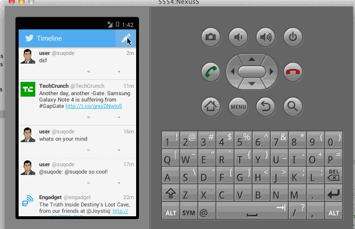

# Twitter Client part 2

## Part 2
The following user stories must be completed:

* User can switch between Timeline and Mention views using tabs.
* User can view their home timeline and mentions tweets with pull-to-refresh and infinite scroll.
* User can navigate to view their own profile
* User can see picture, tagline, # of followers, # of following, and tweets on their profile (using viewpager).
* User can click on the profile image in any tweet to see another user's profile (include user timeline)

* Advanced: Robust error handling
* Advanced: indeterminate progress indicator
* Advanced: User can "reply, retweet or fav from any screen
* The user that wrote the original tweet is automatically "@" replied in compose
* Advanced: User can click on a tweet to be taken to a "detail view" of that tweet
* Advanced: User can take favorite (and unfavorite) or reweet actions on a tweet
* Advanced: Improve the user interface and theme the app to feel twitter branded
* Advanced: User can search for tweets matching a particular query and see results

## Overview (Part 1)

Following user stories were implemented
 * User can sign in to Twitter using OAuth login authentication flow.
 * ser can view the tweets from their home timeline with additional info
 * User can view more tweets as they scroll with infinite pagination
 * Optional: Links in tweets are clickable and will launch the web browser 
 * User can post a tweet. Tweet is visible in timeline.
 * Optional: Network connectivity check.

The following advanced user stories are optional:

 * Advanced: User can refresh tweets timeline by pulling down to refresh (i.e pull-to-refresh)
 * Advanced (Partial): User can open the twitter app offline and see last loaded tweets
 * Tweets are persisted into sqlite and can be displayed from the local DB (Note: Not implemented CusorAdapter).
 * Advanced: User can tap a tweet to display a "detailed" view of that tweet
 * Advanced: User can select "reply" from detail view to respond to a tweet
 * Advanced(Partial): Some branding to make it look like twitter.
 * Bonus: User can see embedded image media within the tweet detail view
 * Bonus: Compose activity is replaced with a modal overlay

GIF created with [LiceCap](http://www.cockos.com/licecap/).
